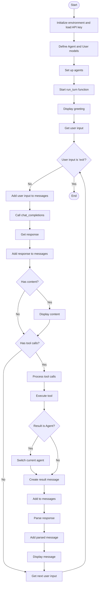

```mermaid
flowchart TD
    Start([Start]) --> Init[Initialize environment and load API key]
    Init --> Models[Define Agent and User models]
    Models --> Setup[Set up agents]
    
    Setup --> RunTurn[Start run_turn function]
    RunTurn --> Greeting[Display greeting]
    Greeting --> GetInput[Get user input]
    
    GetInput --> CheckExit{"User input is 'exit'?"}
    CheckExit -- No --> AddInput[Add user input to messages]
    AddInput --> CallAPI[Call chat_completions]
    CallAPI --> GetResponse[Get response]
    GetResponse --> AddResponse[Add response to messages]
    
    AddResponse --> CheckContent{"Has content?"}
    CheckContent -- Yes --> DisplayContent[Display content]
    CheckContent -- No --> CheckTools
    DisplayContent --> CheckTools{"Has tool calls?"}
    
    CheckTools -- Yes --> ProcessTools[Process tool calls]
    ProcessTools --> ExecuteTool[Execute tool]
    
    ExecuteTool --> CheckAgentResult{"Result is Agent?"}
    CheckAgentResult -- Yes --> SwitchAgent[Switch current agent]
    SwitchAgent --> CreateMessage
    CheckAgentResult -- No --> CreateMessage
    
    CreateMessage[Create result message] --> AddToolMessage[Add to messages]
    AddToolMessage --> ParseResponse[Parse response]
    ParseResponse --> AddParsedMessage[Add parsed message]
    AddParsedMessage --> DisplayMessage[Display message]
    
    CheckTools -- No --> NextInput
    DisplayMessage --> NextInput[Get next user input]
    
    NextInput --> CheckExit
    
    CheckExit -- Yes --> End([End])
```